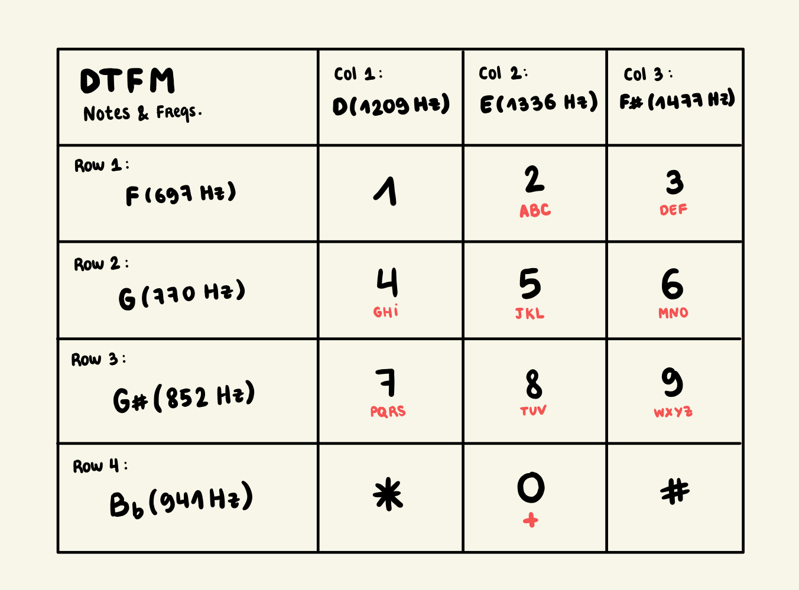

# Hello
On commence par ouvrir le fichier audio. En l'écoutant, on remarqe que ça ressemble à la composition d'un numéro de téléphone.
Après quelques recherches, on remarque que l'on peut associer au code **dual-tone multi-frequency** (DTFM). 

Chaque touche du clavier téléphonique correspond à un couple de deux fréquences émises simultanément. La première fréquence correspond aux lignes et la seconde aux colonnes.

Pour récupérer les fréquences, on ouvre le fichier audio dans Audacity, et lorsque l'on sélectionne la note, on peut aller dans *Analyse > Plot Spectrum*. On remarque qu'il y a deux pics pour les deux notes dont je parlais précédemment.

On récupère les suites de fréquences pour chaque accord :
| Couple d'accords       | Répété *n* fois     | 
|------------------------|---------------------|
| G6 - D7                | 3                   |
| F6 - E7                | 3                   |
| F6 - E7                | 1                   |
| G6 - F#7               | 2                   |
| G#6 - E7               | 1                   |
| G6 - D7                | 2                   |
| F6 - F#7               | 2                   |
| F6 - E7                | 1                   |
| G#6 - D7               | 3                   |
| G#6 - E7               | 2                   |

On s'appuie sur une image qui nous permet de faire la correspondance entre les accords obtenus et les touches du téléphone concernées :

    

On a donc la suite de chiffres : **444 222 2 66 4 8 44 33 2 777 88**

On peut alors voir la correspondance avec les lettres sur le téléphone et on a le message : ICANTHEARU