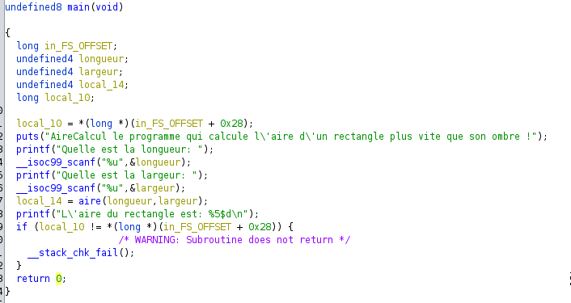
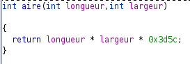

# Aire calcul

## Méthode 1: Statique
On importe le binaire dans Ghidra  

la fonction `main` récupère deux entrées utilisateur puis les envoie dans la fonction `aire`  


la fonction `aire` effectue simplement un calcul avec les deux valeurs  


On peut donc réimplémenter ce calcul en python:  
```python
longueur = 69
largeur = 96

flag = longueur * largeur * 0x3d5c

print(flag)
```

## Méthode 2: dynamique
En dynamique, on peut avoir cette valeur de plusieurs manières:

### Appeler la fonction depuis GDB
GDB nous permet d'appeler une fonction en maîtrisant les paramètres et nous indique la sortie:
```bash
gdb ./AireCalcul1

(gdb) call (int)aire(69,96)
```

### Breakpoint
On peut aussi mettre un breakpoint à l'endroit qui nous intéresse (juste après le retour de la fonction `aire`)
```bash
gdb ./AireCalcul1

(gdb) break *main+136
(gdb) run
```
On entre les valeurs demandée puis on va tomber sur le breakpoint.  
Ce que l'on cherche est la valeur de retour de la fonctoin `aire`, elle est dans dans le registre **RAX** du processeur.  
On peut l'afficher avec `info registers`