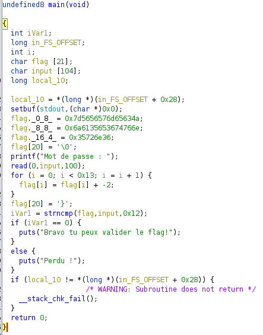

# Baby reverse 1

On ouvre le fichier dans Ghidra pour voir à quoi il ressemble.  


On voit qu'une chaine de caractères est modifiée avant d'être comparée avec l'entrée utilisateur.  
Donc au moment de la comparaison, le flag est en clair. On peut vérifier ça en dynamique en mettant un breakpoint avant l'appel à la fonction `strncmp`  
```bash
gdb ./BabyReverse1

(gdb) b *main+238
```  

On rentre une chaine aléatoire et on tombe sur le breakpoint  
Ce qui nous intéresse, c'est les paramètres de la fonction.  
Comme on est en 64 bits, les paramètres sont dans les registres **RDI** et **RSI**.  
On peut donc afficher les chaines de caractères affichées par ces regitres  
```bash
(gdb) x/s $rdi
(gdb) x/s $rsi
```