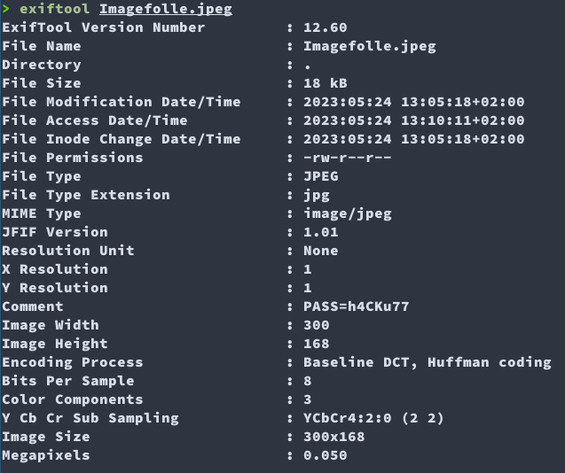
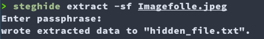

# Image folle

On a un fichier en jpeg mais l'image n'est pas parlante...  
Mais si l'on va voir les métadonnées (exifs), on tombe sur une chaine intéressante

En présence d'une image et d'un mot de passe, on peut utiliser un outil de steganographie: `steghide`

Steghide a extrait le fichier "hidden_file.txt" et son contenu est **4d6a4e6859544d355957466c4d3245784e6a466c4d574e685a5745304d4745784e6a413459324a684e57453d**

Un oeil averti verra que cette chaine ressemble drôlement à de l'ascii  
`python3 -c 'print(bytes.fromhex("4d6a4e6859544d355957466c4d3245784e6a466c4d574e685a5745304d4745784e6a413459324a684e57453d"))'`  
La sortie est:  **MjNhYTM5YWFlM2ExNjFlMWNhZWE0MGExNjA4Y2JhNWE=**

Le '=' en fin de chaine nous fait penser que c'est certainement du base64  
`echo MjNhYTM5YWFlM2ExNjFlMWNhZWE0MGExNjA4Y2JhNWE= | base64 -d`  
La sortie est: **23aa39aae3a161e1caea40a1608cba5a**

ça ressemble à un hash md5, on l'envoie donc dans (crackstation)[https://crackstation.net/] pour le casser.